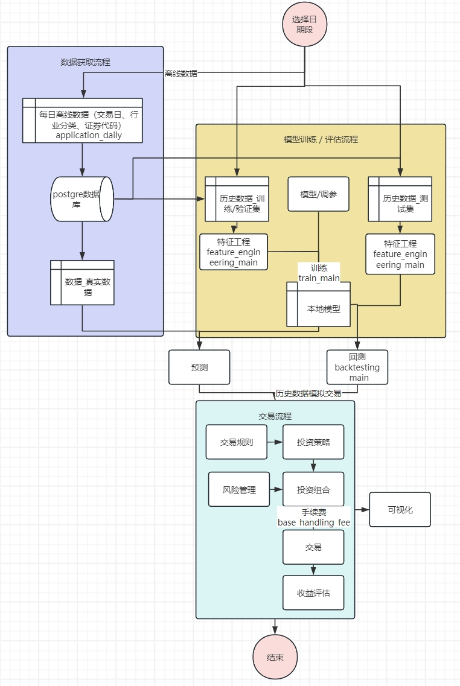
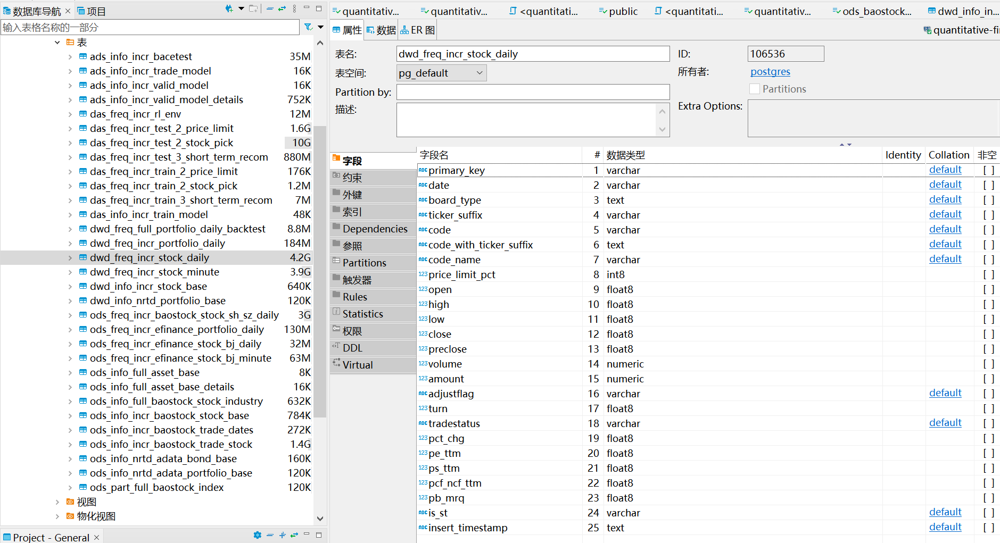
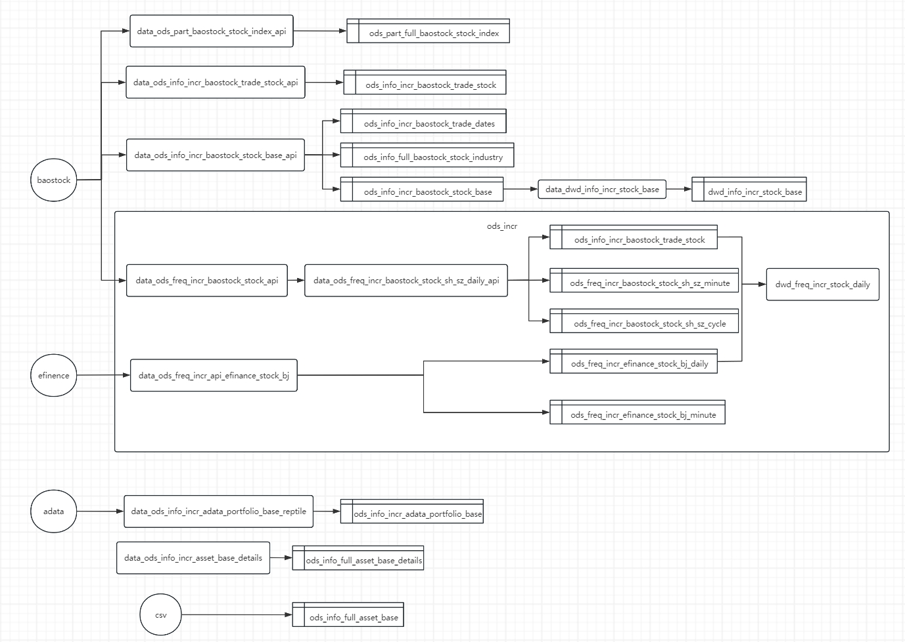

[English Version](./README-EN.md)

<p align="center">
    <a href="https://pypi.org/project/vectorbt" alt="PyPi">
        
    </a>
    <a href="https://github.com/polakowo/vectorbt/blob/master/LICENSE.md" alt="License">
	
    </a>
    <a href="https://codecov.io/gh/polakowo/vectorbt" alt="codecov">
        
    </a>
    <a href="https://vectorbt.dev/" alt="Website">
        
    </a>
    <a href="https://mybinder.org/v2/gh/polakowo/vectorbt/HEAD?urlpath=lab" alt="Binder">
        
    </a>
    <a href="https://gitter.im/vectorbt/community?utm_source=badge&utm_medium=badge&utm_campaign=pr-badge&utm_content=badge" alt="Join the chat at https://gitter.im/vectorbt/community">
        
    </a>
</p>
<p align="center">
    <a href="https://pypi.org/project/vectorbt" alt="Python Versions">
        
    </a>
</p>


## 海鸥量化

```
 seagull = 数据 + 策略 + 回测 + 可视化 + 自动化交易
            |      |      |      |          |
            |      |      |      |           \_ vnpy
            |      |      |       \____________ seaborn
            |      |       \___________________ vectorbt
            |      \___________________________ qlib, lightgbm
            \__________________________________ adata, baostock, efinance
```


## 初始化

* python

* ```bash
	$ git clone https://github.com/StarlightDamian/lr-camera-presets.git
	```
	
* 配置数据库信息

  /seagull-quantization/conf/setting_global.txt

  

## 快速开始

* 服务器提交，每日定时获取增量数据，输出至数据库

```bash
$ cd seagull-quantization
$ nohup python main.py & > /log/main.log 2>&1 & 
```

* 输入**股票代码**，返回下一个交易日推荐买入 / 卖出价格

```bash
$ python main.py 
```

* 通过macd对多只回测历史数据
```bash
$ python /lib/backtest/backtest_vectorbt.py 
	--strategy macd
    --date_start 2019-01-01
    --date_end 2023-01-01
    --full_code SH.510300
```

    # 回测2019-01-01至2023-01-01所有ETF数据
    # ETF基准和macd策略收益对比
    
    full_code     base   strategy  strategy_better
                                                       
    SH.513360   2.781000  22.855000         20.07400
    SH.516820   5.037000  23.008000         17.97100
    SH.588060   9.589000  25.896000         16.30700
    SZ.159847   7.608000  23.527000         15.91900
    SH.513860   3.774000  19.662000         15.88800
                 ...        ...              ...
    SH.511950  27.319000  11.114000        -16.20500
    SH.512690  63.031000  43.649000        -19.38200
    SH.510090  29.653000   9.726000        -19.92700
    SH.512390  34.175000  11.935000        -22.24000
    mean       20.523068  23.008397          2.48533
    [676 rows x 3 columns]
    
    # 不同macd参数横向对比，其中14-28双均线效果最好
    
    window
    14-28-10          23.478
    13-28-10          23.341
    12-28-10          23.306
    14-27-10          23.271
    13-27-10          23.214
     
    11-25-10          22.724
    10-25-10          22.678
    14-24-10          22.585
    10-24-10          22.512
    None-None-None    20.657
    Length: 26, dtype: float64


​    
## 回测

|  特征  |                    回测脚本                    |                             结论                             | 备注 |
| :----: | :--------------------------------------------: | :----------------------------------------------------------: | :--: |
| 双均线 | /lib/backtest/backtest_vectorbt_moving_average |            金叉买死叉买，或者相反均跑不过沪深300             |      |
|  macd  |      /lib/backtest/backtest_vectorbt_macd      | 牛市跑不过沪深300一直持有<br />下跌周期更抗跌<br />macd只有买入、卖出相互交叉，没有仓位概念<br />表现最好的参数14-27-10 |      |
|        |                                                |                                                              |      |
|        |                                                |                                                              |      |
|        |                                                |                                                              |      |


## 版本更新

|          版本           |  上线日期  |                           新增功能                           |                备注                |
| :---------------------: | :--------: | :----------------------------------------------------------: | :--------------------------------: |
|  v0.1.0_20231227_alpha  | 2023-12-27 | 1.单一股票进行股价预测<br />2.单一股票的买入点和卖出点<br />3.训练一只股票模型速度为15分钟 |                                    |
|  v0.2.0_20240222_beta   | 2024-02-22 | 1.不再进行单一股票的训练与预测，而且把整个股市全天的数据为单位进行训练与预测。<br/>2.重点优化推票的逻辑，进行每日TOP5的推票，进行多次回测，优化推票逻辑。 |                                    |
|   v0.2.1_20240226_rc    | 2024-02-26 | 1.接入15分钟线数据<br />2.首页按推荐排序，推荐效果优化至可用<br />3.去除成交额为0和一字涨跌停数据预测，减少干扰项 |                                    |
| v0.2.2_20240222_release | 2024-03-26 | 1.分类为主板、创业板、科创版、新三板、北交所，在模型训练和预测阶段限制每日涨跌幅为相应比例 | 修改了训练、评估、测试阶段的逻辑。 |
|  v0.3.0_20240925_beta   | 2024-09-25 |          1.新增向量化回测，快速大批量的回测历史数据          |                                    |


## 开发计划

| 优先级 |                             功能                             | 备注 |
| :----: | :----------------------------------------------------------: | :--: |
|   1    | 在适合买入/卖出的时候，提供**指定股票代码**的推荐买入价格/卖出价格 |      |
|   1    |                    提供该策略的历史回测图                    |      |
|   2    | 在适合买入/卖出的时候，提供**全部股票代码**的推荐买入价格/卖出价格 |      |
|   2    |            提供**全部股票代码**该策略的历史回测图            |      |
|   2    |                 补充**宏观经济指标**作为特征                 |      |
|   3    |                         **模糊搜索**                         |      |
|   3    |             日线输出推荐，修改为**15分钟线**推荐             |      |
|   4    |                         微信自动回复                         |      |
|   4    | 做这个拉群最终的目的是 你要根据板块的分析 或者当天的新闻筛选出最优化的几只 |      |
|   4    | 推票就是这样 是提供买哪只 而不是只单单的预测我自己要买的价格 |      |


## 优化方向

|   类别   |       功能       | 备注 |
| :------: | :--------------: | :--: |
| 投资组合 |     投资组合     |      |
| 宏观特征 |    季报、年报    |      |
|   特征   |  持仓比例和成本  |      |
|   特征   |   主力流入流出   |      |
|   模型   |    用rank来做    |      |
|   特征   |    小市值策略    |      |
|   特征   | 仓位对策略的影响 |      |
|          |                  |      |


## 流程图


<div style="text-align: center;">  
    
	<p style="text-align: center;">整体流程图</p>  
    
    <p style="text-align: center;">数据库概览</p>  
    
    <p style="text-align: center;">数据获取流程</p>  
</div>


## 参考

【1】https://github.com/polakowo/vectorbt/tree/54cbe7c5bff332b510d1075c5cf11d006c1b1846

【2】https://efinance.readthedocs.io/en/latest/


```
@article{seagull-quantization,
  author = {Starlight Damian},
  title = {seagull-quantization: Local quantitative research platform
},
  year = {2024}
}
```

